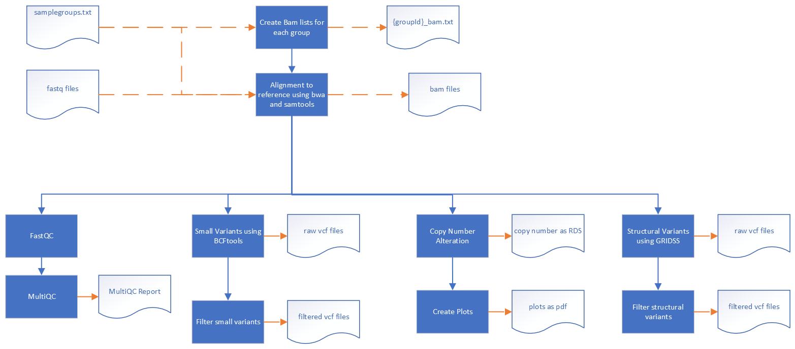

# Analysis of genomic variation in Plasmodium falciparum samples.

## Description 
The pipeline reads paired-end sequence files in FASTQ format, together with a metadata file.
The metadata file (default samplegroup.txt) defines the reference genome to use for each sample (P. falciparum 3D7 or DD2), a group ID for each sample, and a sample or group of samples to use as a comparison or control, called the parent samples.
 
Samples are aligned to the reference genome using bwa-mem. Small variants are called with bcftools[[1]](#1), copy-number alterations with QDNASeq[[2]](#2), and structural variants with GRIDSS[[3]](#3), with joint calling of all samples in a group.
Variants are filtered to high-confidence variants present in a majority of the non-parent samples in a group, and absent or low-confidence in parent samples.

The default definition of majority is n/2 + 1, but can be set to any value, including 1, using parameter critsamplecount
 

## To run on Milton
```
./runpipeline.sh
```
## To resume on Milton
```
./resumepipeline.sh
```

This will use all config parameters found in `nextflow.config`.

## Format of metadata file

It is a tab-delimited text file, with 5 columns. The columns are (`groupId`, `sampleId`, `fastqbase`, `ref`, `parentId`)

Example of metadata file with 2 groups. Group L-076R has a single parent sample; group L-492M has 2 parent samples.

groupId	|sampleId	|fastqbase	|ref	|parentId
---     |---      |---       |--- |---
L-076R	|L-076R1	|L-076_Revern_1_S11_L001	|3D7	|3D7D3B3
L-076R	|L-076R2	|L-076_Revern_2_S12_L001	|3D7	|3D7D3B3
L-492M	|L-492MIR2.1	|L-492_MIR_clone_2_1_S19_L001	|Dd2	|DD2s
L-492M	|L-492MIR2.2	|L-492_MIR_clone_2_2_S20_L001	|Dd2	|DD2s
3D7D3B3	|PF-3D7D3B3-uncl	|PF-3D7D3B3-uncloned_S1	|3D7		
DD2s	|DD2_1	|DD21_S13_L001	|Dd2		|
DD2s	|DD2_2	|DD22_S14_L001	|Dd2		|

### **Notes**
* `sampleid` must contain `groupid`
* If parent is not a sample add a line with no parentid
* fastqbase is the sequence fastq filename up to _R[12]

## References
<a id="1">[1]</a>  Li H. A statistical framework for SNP calling, mutation discovery, association mapping and population genetical parameter estimation from sequencing data. Bioinformatics (2011) 27(21) 2987-93 https://www.htslib.org/

<a id="2">[2]</a>  Scheinin I, Sie D, Bengtsson H, van de Wiel MA, Olshen AB, van Thuijl HF, van Essen HF, Eijk PP, Rustenburg F, Meijer GA, Reijneveld JC, Wesseling P, Pinkel D, Albertson DG and Ylstra B. DNA copy number analysis of fresh and formalin-fixed specimens by shallow whole-genome sequencing with identification and exclusion of problematic regions in the genome assembly. Genome Research 24: 2022-2032, 2014.

<a id="3">[3]</a>  Cameron DL, Baber J, Shale C, Valle-Inclan JE, Besselink N, van Hoeck A, Janssen R, Cuppen E, Priestley P, Papenfuss AT. GRIDSS2: comprehensive characterisation of somatic structural variation using single breakend variants and structural variant phasing. Genome Biol. 2021 Jul 12;22(1):202.
